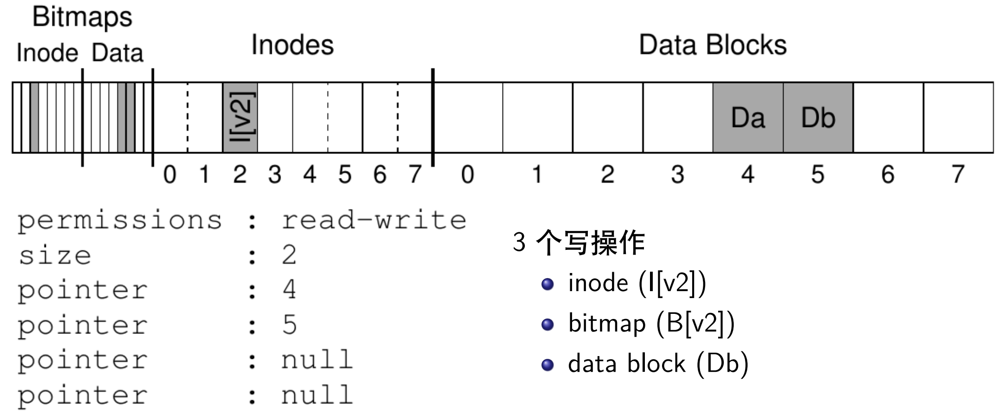
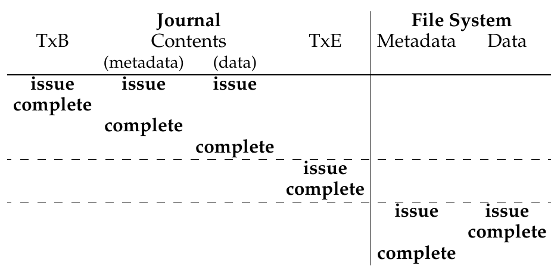

<!-- theme: gaia -->
<!-- _class: lead -->

## 第九讲 文件系统

### 第三节 支持崩溃一致性的文件系统

--- 
### 支持崩溃一致性的文件系统
文件系统面临的一个主要挑战在于，如何在出现断电（power loss）或系统崩溃（system crash）的情况下，更新持久数据结构。

由于崩溃而导致磁盘文件系统映像可能出现的许多问题：在文件系统数据结构中可能存在不一致性。可能有空间泄露，可能将垃圾数据返回给用户，等等。

--- 
### 支持崩溃一致性的文件系统

崩溃一致性问题（crash-consistency problem）也称,一致性更新问题，consistent-update problem）
- 为了完成特定操作，你必须更新两个磁盘上的结构A和B。由于磁盘一次只为一个请求提供服务，因此其中一个请求将首先到达磁盘（A或B）。如果在一次写入完成后系统崩溃或断电，则磁盘上的结构将处于不一致（inconsistent）的状态。

--- 
### 支持崩溃一致性的文件系统

理想的做法是将文件系统从一个一致状态（在文件被追加之前），原子地（atomically）移动到另一个状态（在inode、位图和新数据块被写入磁盘之后）。

但做到这一点不容易，因为磁盘一次只提交一次写入，而这些更新之间可能会发生崩溃或断电。

--- 
### 支持崩溃一致性的文件系统
例子：
- 一个应用以某种方式更新磁盘结构：将单个数据块附加到原有文件。
  - 通过打开文件，调用`lseek()`将文件偏移量移动到文件末尾，然后在关闭文件之前，向文件发出单个4KB写入来完成追加。

--- 
### 支持崩溃一致性的文件系统
文件系统包括一个inode位图（inode bitmap，只有8位，每个inode一个），一个数据位图（data bitmap，也是8位，每个数据块一个），inode（总共8个，编号为0到7，分布在4个块上），以及数据块（总共8个，编号为0～7）。以下是该文件系统的示意图：

--- 
### 支持崩溃一致性的文件系统
一个应用以某种方式更新磁盘结构：将单个数据块附加到原有文件

要实现这种转变，文件系统必须对磁盘执行3次单独写入，分别针对inode（I[v2]），位图（B[v2]）和数据块（Db）。请注意，当用户发出write()系统调用时，这些写操作通常不会立即发生。脏的inode、位图和新数据先在内存（页面缓存，page cache，或缓冲区缓存，buffer cache）中存在一段时间。然后，当文件系统最终决定将它们写入磁盘时（比如说5s或30s），文件系统将向磁盘发出必要的写入请求。

--- 
### 支持崩溃一致性的文件系统
一个应用以某种方式更新磁盘结构：将单个数据块附加到原有文件

--- 
### 支持崩溃一致性的文件系统
在文件操作过程中可能会发生崩溃，从而干扰磁盘的这些更新。特别是，如果这些写入中的一个或两个完成后发生崩溃，而不是全部 3个，则文件系统可能处于有趣的状态。

--- 
### 支持崩溃一致性的文件系统
崩溃场景 
- 1. 只将数据块（Db）写入磁盘。在这种情况下，数据在磁盘上，但是没有指向它的inode，也没有表示块已分配的位图。因此，就好像写入从未发生过一样。

--- 
### 支持崩溃一致性的文件系统
崩溃场景 
- 2. 只有更新的inode（I[v2]）写入了磁盘。在这种情况下，inode指向磁盘地址（5），其中Db即将写入，但Db尚未写入。因此，如果我们信任该指针，我们将从磁盘读取垃圾数据（磁盘地址5的旧内容）。

--- 
### 支持崩溃一致性的文件系统
崩溃场景 
- 3. 只有更新后的位图（B [v2]）写入了磁盘。在这种情况下，位图指示已分配块5，但没有指向它的inode。因此文件系统再次不一致。如果不解决，这种写入将导致空间泄露（space leak），因为文件系统永远不会使用块5。

--- 
### 支持崩溃一致性的文件系统
崩溃场景 
- 4. inode（I[v2]）和位图（B[v2]）写入了磁盘，但没有写入数据（Db）。在这种情况下，文件系统元数据是完全一致的：inode有一个指向块5的指针，位图指示5正在使用，因此从文件系统的元数据的角度来看，一切看起来都很正常。但是有一个问题：5中又是垃圾。

--- 
### 支持崩溃一致性的文件系统
崩溃场景 
- 5. 写入了inode（I[v2]）和数据块（Db），但没有写入位图（B[v2]）。在这种情况下，inode指向了磁盘上的正确数据，但同样在inode和位图（B1）的旧版本之间存在不一致。因此，我们在使用文件系统之前，又需要解决问题。

--- 
### 支持崩溃一致性的文件系统
崩溃场景 
- 6. 写入了位图（B[v2]）和数据块（Db），但没有写入inode（I[v2]）。在这种情况下，inode和数据位图之间再次存在不一致。但是，即使写入块并且位图指示其使用，我们也不知道它属于哪个文件，因为没有inode指向该块。

--- 
### 支持崩溃一致性的文件系统
解决方案1：文件系统检查程序 fsck

早期的文件系统采用了一种简单的方法来处理崩溃一致性。基本上，它们决定让不一致的事情发生，然后再修复它们（重启时）。

唯一目标，是确保文件系统元数据内部一致。

--- 
### 支持崩溃一致性的文件系统
解决方案1：文件系统检查程序 fsck
- 超级块：fsck首先检查超级块是否合理，主要是进行健全性检查，例如确保文件系统大小大于分配的块数。通常，这些健全性检查的目的是找到一个可疑的（冲突的）超级块。在这种情况下，系统（或管理员）可以决定使用超级块的备用副本。

--- 
### 支持崩溃一致性的文件系统
解决方案1：文件系统检查程序 fsck
- 空闲块：接下来，fsck扫描inode、间接块、双重间接块等，以了解当前在文件系统中分配的块。它利用这些知识生成正确版本的分配位图。因此，如果位图和inode之间存在任何不一致，则通过信任inode内的信息来解决它。对所有inode执行相同类型的检查，确保所有看起来像在用的inode，都在inode位图中有标记。

--- 
### 支持崩溃一致性的文件系统
解决方案1：文件系统检查程序 fsck
- inode状态：检查每个inode是否存在损坏或其他问题。例如，fsck确保每个分配的inode具有有效的类型字段（即常规文件、目录、符号链接等）。如果inode字段存在问题，不易修复，则inode被认为是可疑的，并被fsck清除，inode位图相应地更新。

--- 
### 支持崩溃一致性的文件系统
解决方案1：文件系统检查程序 fsck
- inode链接：fsck还会验证每个已分配的inode的链接数。你可能还记得，链接计数表示包含此特定文件的引用（即链接）的不同目录的数量。为了验证链接计数，fsck从根目录开始扫描整个目录树，并为文件系统中的每个文件和目录构建自己的链接计数。如果新计算的计数与inode中找到的计数不匹配，则必须采取纠正措施，通常是修复inode中的计数。如果发现已分配的inode但没有目录引用它，则会将其移动到lost + found目录。

--- 
### 支持崩溃一致性的文件系统
解决方案1：文件系统检查程序 fsck

- 重复：fsck还检查重复指针，即两个不同的inode引用同一个块的情况。如果一个inode明显不好，可能会被清除。或者，可以复制指向的块，从而根据需要为每个inode提供其自己的副本。

--- 
### 支持崩溃一致性的文件系统
解决方案1：文件系统检查程序 fsck
- 坏块：在扫描所有指针列表时，还会检查坏块指针。如果指针显然指向超出其有效范围的某个指针，则该指针被认为是“坏的”，例如，它的地址指向大于分区大小的块。在这种情况下，fsck不能做任何太聪明的事情。它只是从inode或间接块中删除（清除）该指针。

--- 
### 支持崩溃一致性的文件系统
解决方案1：文件系统检查程序 fsck
- 目录检查：fsck不了解用户文件的内容。但是，目录包含由文件系统本身创建的特定格式的信息。因此，fsck对每个目录的内容执行额外的完整性检查，确保“.”和“..”是前面的条目，目录条目中引用的每个inode都已分配，并确保整个层次结构中没有目录的引用超过一次。
--- 
### 支持崩溃一致性的文件系统
解决方案1：文件系统检查程序 fsck
- 不足之处
  -  对于非常大的磁盘卷，扫描整个磁盘，以查找所有已分配的块并读取整个目录树，可能需要几分钟或几小时。

--- 
### 支持崩溃一致性的文件系统
解决方案2：日志（或预写日志）

对于一致更新问题，最流行的解决方案可能是从数据库管理系统的世界中借鉴的一个想法。这种名为预写日志（write-ahead logging）的想法，是为了解决这类问题而发明的。在文件系统中，出于历史原因，我们通常将预写日志称为日志（journaling）。第一个实现它的文件系统是Cedar [H87]，但许多现代文件系统都使用这个想法，包括Linux ext3和ext4、reiserfs、IBM的JFS、SGI的XFS和Windows NTFS。

--- 
### 支持崩溃一致性的文件系统
解决方案2：日志（或预写日志）

基本思路
- 更新磁盘时，在覆写结构之前，首先写下一点小注记（在磁盘上的其他地方，在一个众所周知的位置），描述你将要做的事情。写下这个注记就是“预写”部分，我们把它写入一个结构，并组织成“日志”。因此，就有了预写日志。
--- 
### 支持崩溃一致性的文件系统
解决方案2：日志（或预写日志）
基本思路
- 通过将注释写入磁盘，可以保证在更新（覆写）正在更新的结构期间发生崩溃时，能够返回并查看你所做的注记，然后重试。因此，你会在崩溃后准确知道要修复的内容（以及如何修复它），而不必扫描整个磁盘。因此，通过设计，日志功能在更新期间增加了一些工作量，从而大大减少了恢复期间所需的工作量。

--- 
### 支持崩溃一致性的文件系统
解决方案2：日志（或预写日志）
数据日志（data journaling）

- TxB:transaction 开始
- TxE:transaction 结束
- logical logging: 中间 3 块数据
--- 
### 支持崩溃一致性的文件系统
解决方案2：日志（或预写日志）
数据日志（data journaling）

上述 transaction 写到磁盘上后, 更新磁盘，覆盖相关结构 (checkpoint)
  - I[V2] B[v2] Db

--- 
### 支持崩溃一致性的文件系统
解决方案2：日志（或预写日志）
写入日志期间发生崩溃
磁盘内部可以（1）写入TxB、I[v2]、B[v2]和TxE，然后才写入Db。遗憾的是，如果磁盘在（1）和（2）之间断电，那么磁盘上会变成：

--- 
### 支持崩溃一致性的文件系统
解决方案2：日志（或预写日志）
为避免该问题，文件系统分两步发出事务写入。首先，它将除TxE块之外的所有块写入日志，同时发出这些写入。当这些写入完成时，日志将看起来像这样（假设又是文件追加的工作负载）：

--- 
### 支持崩溃一致性的文件系统
解决方案2：日志（或预写日志）
当这些写入完成时，文件系统会发出TxE块的写入，从而使日志处于最终的安全状态：

--- 
### 支持崩溃一致性的文件系统
解决方案2：日志（或预写日志）
此过程的一个重要方面是磁盘提供的原子性保证。因此，我们当前更新文件系统的协议如下，3个阶段中的每一个都标上了名称。
- 1．日志写入：将事务的内容（包括TxB、元数据和数据）写入日志，等待这些写入完成。
- 2．日志提交：将事务提交块（包括TxE）写入日志，等待写完成，事务被认为已提交（committed）。
- 3．加检查点：将更新内容（元数据和数据）写入其最终的磁盘位置。

--- 
### 支持崩溃一致性的文件系统
解决方案2：日志（或预写日志）
恢复
在此更新序列期间的任何时间都可能发生崩溃。

- 如果崩溃发生在将事务安全地写入日志之前
- 如果崩溃是在事务提交到日志之后，但在检查点完成之前发生

太多写，慢！

--- 
### 支持崩溃一致性的文件系统
解决方案2：日志（或预写日志） -- 恢复 -- 提高速度
- 批处理日志更新
- 使日志有限：循环日志
- 日志超级块 journal superblock

--- 
### 支持崩溃一致性的文件系统
解决方案2：日志（或预写日志） -- 恢复 -- 提高速度
新的更新过程
- Journal write
- Journal commit
- Checkpoint
- Free: 一段时间后，通过更新日记帐，超级块将交易记录标记为空闲

--- 
### 支持崩溃一致性的文件系统
解决方案2：Metadata Journaling:  进一步提高速度

- 我们什么时候应该将数据块 Db 写入磁盘？
- 事实证明，数据写入的顺序对于仅元数据的日记记录确实很重要。
- 如果在事务（包含 I [v2] 和 B [v2]）完成后将 Db 写入磁盘，这样有问题吗？

--- 
### 支持崩溃一致性的文件系统
解决方案2：Metadata Journaling:  进一步提高速度

新的更新过程
- Data write
- Journal metadata write
- Journal commit
- Checkpoint metadata
- Free

通过强制首先写入数据，文件系统可保证指针永远不会指向垃圾数据。

--- 

Data Journaling时间线 v.s. Metadata Journaling时间线	

